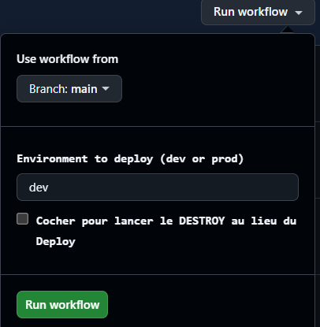

# terraform-ansible_Test

Description simple:

- Projet minimal combinant Terraform et Ansible.
- Terraform crée l'infrastructure (VM, réseau, etc.).
- Ansible configure la VM (installe Nginx et déploie une page web).

Intérêt:

- Automatiser la création et la configuration d'une application web.
- Séparer l'étape d'infrastructure (Terraform) de la configuration (Ansible).

Le déploiement dispose de deux environnements (choisis manuelement)
Pour lancer l'execution, il faut allez dans Actions => Workflows => choisir l'env

Le workflow dispose d'une case a cocher pour initier un destroy,

Un deploy ou un destroy demandera 2actions manuel pour lancer l'automatisation
Lancement manuel => Puis validation des Plan pour lancer l'apply 

--------------------

Questions /reponses

T1. À quoi sert le fichier terraform.tfstate ?
Le fichier Tfstate permet de garder l'etat de l'infra au moment du dernier apply
Cela permet de pouvoir avoir un PLAN utile, afin de comparer les changements entre le code et l'état reel de l'infra 

T2. Quelle est la différence entre terraform plan et terraform apply ?
Le Plan correle l'état entre le code et l'état reeel  de l'infra a l'instant T
Le Apply, executera les changements, entre l'état du code actuel en comparant le tfstate, et prendra comme reference le PLAN

T3. Pourquoi utiliser des variables dans Terraform ?
Les varaibales permete de simplifier le code, et de le personaliser dynamiquement au besoin, on evite les repetitions de code

T4. Que se passe-t-il si une ressource créée par Terraform est supprimée manuellement ?
Lors du prochain PLAN, le resultat montrera que le Tfstate n'est pas égale à l'infra actuel = Apply impossible => pour remedier cela, il faudrait enlever le bloc terraform qui a build cette ressource ou selon la possibilité, recreer la ressource manuellement avec EXACTEMENT les memes variable 

A1. Qu’est-ce que l’idempotence en Ansible ?
L'idempotence permet de ne pas executer une tache deja validé

A2. À quoi sert un handler ?
Permet de donner des actions en fonction des resultats d'une task, un restart/reload/stop 

A3. Quelle est la différence entre un inventory statique et dynamique ?
Le statique doit etre configuré a la main, cela peut etre long et contenir des erreurs humaines
Le dynamique est automatisé et ce base a une autre ressource type AD ou CMDB, cela evite les actions humaines et reduit le risque d'erreur humaine

A4. Quelle commande permet de tester un playbook sans appliquer de changements ?
ansible-playbook hosts.ini playbook.yml --check

1. Expliquer comment récupérer l’adresse IP de la VM créée par Terraform
pour l’utiliser dans Ansible
Les outputs permettes de recuperer des varaibles dans le builds, pour les réinjecter dans la suite du pipeline

2. Expliquer pourquoi Ansible doit être exécuté après Terraform
Ansible doit etre executé apres terraform car Terraform est la technoloie qui construit l'infra => ansible lui va configurer cette infra

--------------------------------------------------
I1. Pourquoi est-il déconseillé d’exécuter Ansible avant Terraform ?
IL est deconseillé d'executer Ansible avant terraform, car Ansible a pour mission de changer la configuration, si la tache terraform suivante vient a supprimer une ressources ou la modifier scela va impacter la configuration, et il faudra relancer Ansible

I2. Donner un avantage et un inconvénient de l’approche Terraform + Ansible
L'avantage est l'automatisation de la creation / configuration d'infra afin de reduire les erreurs humaines
L'incoveniant est que cela est exigeant en compétences, l'IA peut donc aider mais egalement generer des failles dans la configurations, qu'une personne non qualifé ne saura pas reconnaitre
